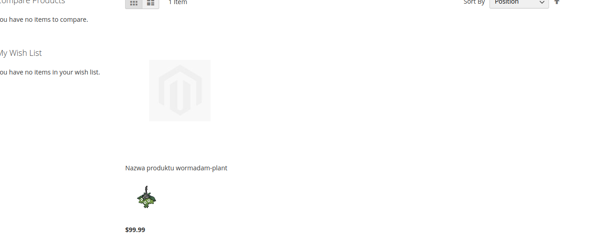

# PokeApi Module for Magento 2

A Magento 2 module that integrates Pokemon data into your product catalog by connecting to the PokeApi.

## Features

- Enhances product names with Pokemon names
- Displays Pokemon images alongside products
- Customizes category product listing view
- Provides Pokemon information block

## Demo

## Requirements

- Magento 2.4.x
- PHP 8.1 or higher
- Magento_Catalog module

## Installation

1. Create directory `app/code/Akid/PokeApi` in your Magento installation
2. Copy the module files to the directory
3. Enable the module by running: $ bin/magento module:enable Akid_PokeApi
4. Run the setup:upgrade command: $ bin/magento setup:upgrade
5. Run the setup:di:compile command: $ bin/magento setup:di:compile
6. Run the setup:static-content:deploy command: $ bin/magento setup:static-content:deploy
7. Clear the cache: $ bin/magento cache:clean
